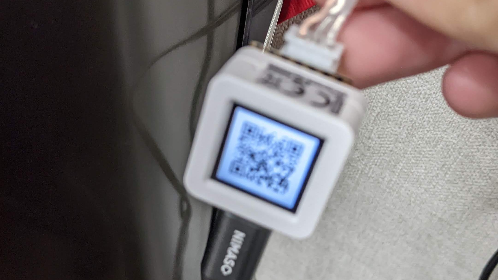
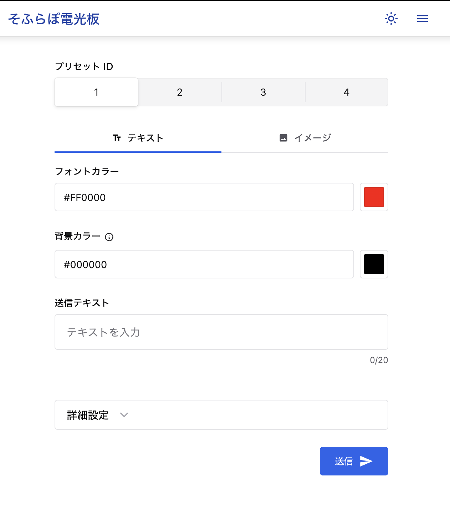

## LED Curtain

窓に取り付けられた LED マトリクスに任意のテキストを表示するプログラム

### 機能

マイコン上に Web サーバを立てます．
本プロジェクトでは AtomS3 を使用しました．
このサーバには，ディスプレイに表示された QR コードを読み取ることでアクセスできます．



QR コードを読み取ると，サーバにデータを送信するためのページが表示されます．
テキストを入力して送信することで，LED マトリクスに表示されます．
テキストは 4 セットまで保存することができ，順繰りに表示されます．



実際の動作は以下の動画で確認できます．

<video controls src="img/led-curtain.mov" title="Title"></video>
## セットアップ

### 1. クローン
### 2. サブモジュールの初期化
```sh
git submodule update --init
```

### 3. フロントエンドのビルド
```sh
cd led-curtain-frontend
npm install
npx vite build --outDir ../data/dist
cd ..
```
    
### 4. コンフィグのコピーと必要項目の編集
```sh
cp include/lc_config.h.sample include/lc_config.h
```

### 5. プログラムのビルドとアップロード
```sh
pio run --target build
pio run --target upload
```

### 6. ファイルシステムのビルドとアップロード
```sh
pio run --target buildfs
pio run --target uploadfs
```


